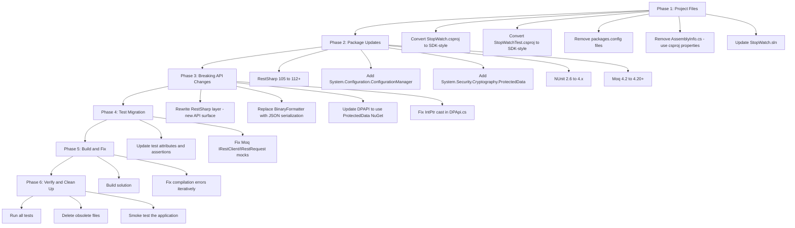

# .NET 10 SDK Migration Plan — Jira StopWatch

## Executive Summary

Migrate the Jira StopWatch Windows Forms application from **.NET Framework 4.5** (legacy csproj) to **.NET 10** (SDK-style csproj). This is a major migration spanning project format, target framework, NuGet packages, and deprecated APIs.

---

## Current State Analysis

| Component | Current | Target |
|---|---|---|
| Framework | .NET Framework 4.5 | .NET 10 (`net10.0-windows`) |
| Project Format | Legacy csproj (verbose XML) | SDK-style csproj |
| Solution Format | VS 2014 (format 12.00) | Modern VS format |
| Package Management | `packages.config` | `PackageReference` |
| RestSharp | 105.2.3 | 112.x+ (latest) |
| NUnit | 2.6.4 | 4.x |
| Moq | 4.2.1510.2205 | 4.20+ |
| NUnitTestAdapter | 2.0.0 | NUnit3TestAdapter 4.x |
| BinaryFormatter | Used for settings serialization | JSON serialization replacement |
| DPAPI | Direct P/Invoke to crypt32.dll | `System.Security.Cryptography.ProtectedData` NuGet |
| Setup Project | .vdproj (VS Installer) | Out of scope — publish profile or MSIX |

### Projects in Solution

1. **StopWatch** — WinForms desktop app (`WinExe`)
2. **StopWatchTest** — Unit test project (`Library`)
3. **StopWatchSetup** — VS Installer setup project (separate solution, out of scope)

### Key Dependencies on Windows APIs

- `System.Windows.Forms` — WinForms UI ✅ (supported via `net10.0-windows`)
- `System.Drawing` — GDI+ graphics ✅ (supported)
- `crypt32.dll` P/Invoke — DPAPI encryption ⚠️ (needs `System.Security.Cryptography.ProtectedData` NuGet)
- `user32.dll` P/Invoke — `PostMessage`, `RegisterWindowMessage` ✅ (still works)
- `Microsoft.Win32.SystemEvents.SessionSwitch` ✅ (supported in .NET 10 Windows)
- `System.Configuration.ApplicationSettingsBase` ⚠️ (needs `System.Configuration.ConfigurationManager` NuGet)
- `System.Runtime.Serialization.Formatters.Binary.BinaryFormatter` ❌ (removed in .NET 8+)

---

## Migration Architecture



---

## Detailed Task Breakdown

### Phase 1: Convert Project Files to SDK-Style

#### Task 1.1: Rewrite `source/StopWatch/StopWatch.csproj`

Replace the entire legacy csproj with an SDK-style csproj targeting `net10.0-windows`:

```xml
<Project Sdk="Microsoft.NET.Sdk">

  <PropertyGroup>
    <OutputType>WinExe</OutputType>
    <TargetFramework>net10.0-windows</TargetFramework>
    <UseWindowsForms>true</UseWindowsForms>
    <RootNamespace>StopWatch</RootNamespace>
    <AssemblyName>StopWatch</AssemblyName>
    <ApplicationIcon>stopwatchicon.ico</ApplicationIcon>
    <TreatWarningsAsErrors>true</TreatWarningsAsErrors>

    <!-- Assembly metadata previously in AssemblyInfo.cs -->
    <AssemblyTitle>Jira StopWatch</AssemblyTitle>
    <Product>Jira StopWatch</Product>
    <Copyright>
      Copyright © 2026 Marco Leonor
      Copyright © 2023 Y. Meyer-Norwood
      Copyright © 2020 Dan Tulloh
      Copyright © 2016 Carsten Gehling
      https://jirastopwatch.com/humans
    </Copyright>
    <AssemblyVersion>2.3.0</AssemblyVersion>
    <FileVersion>2.3.0</FileVersion>
    <InformationalVersion>2.3.0</InformationalVersion>
  </PropertyGroup>

  <ItemGroup>
    <PackageReference Include="RestSharp" Version="112.*" />
    <PackageReference Include="System.Configuration.ConfigurationManager" Version="9.*" />
    <PackageReference Include="System.Security.Cryptography.ProtectedData" Version="9.*" />
  </ItemGroup>

  <!-- InternalsVisibleTo for test project -->
  <ItemGroup>
    <InternalsVisibleTo Include="StopWatchTest" />
    <InternalsVisibleTo Include="DynamicProxyGenAssembly2" />
  </ItemGroup>

</Project>
```

**Key changes:**
- SDK-style format auto-includes all `.cs` files (no manual `<Compile>` items)
- SDK-style format auto-includes all `.resx` files
- `UseWindowsForms` replaces manual `System.Windows.Forms` reference
- `PackageReference` replaces `packages.config`
- Assembly attributes move from `AssemblyInfo.cs` to csproj properties
- Icon and resource files included automatically via globbing

#### Task 1.2: Rewrite `source/StopWatchTest/StopWatchTest.csproj`

```xml
<Project Sdk="Microsoft.NET.Sdk">

  <PropertyGroup>
    <TargetFramework>net10.0-windows</TargetFramework>
    <RootNamespace>StopWatchTest</RootNamespace>
    <AssemblyName>StopWatchTest</AssemblyName>
    <IsPackable>false</IsPackable>
  </PropertyGroup>

  <ItemGroup>
    <PackageReference Include="NUnit" Version="4.*" />
    <PackageReference Include="NUnit3TestAdapter" Version="4.*" />
    <PackageReference Include="Moq" Version="4.20.*" />
    <PackageReference Include="Microsoft.NET.Test.Sdk" Version="17.*" />
    <PackageReference Include="RestSharp" Version="112.*" />
  </ItemGroup>

  <ItemGroup>
    <ProjectReference Include="..\StopWatch\StopWatch.csproj" />
  </ItemGroup>

</Project>
```

#### Task 1.3: Delete Obsolete Files

- `source/StopWatch/packages.config`
- `source/StopWatchTest/packages.config`
- `source/StopWatch/Properties/AssemblyInfo.cs`
- `source/StopWatchTest/Properties/AssemblyInfo.cs`
- The `packages/` folder at solution root (if present)

#### Task 1.4: Update `StopWatch.sln`

Update the Visual Studio version header. Remove the StopWatchSetup project reference if present in the main solution.

---

### Phase 2: RestSharp API Migration (Major Breaking Changes)

RestSharp v107+ removed `IRestClient` and `IRestRequest` interfaces entirely. The API surface changed drastically. This is the **most complex part** of the migration.

#### RestSharp Breaking Changes Summary

| Old API (v105) | New API (v112+) |
|---|---|
| `IRestClient` interface | `RestClient` class (no interface) |
| `IRestRequest` interface | `RestRequest` class (no interface) |
| `IRestResponse<T>` interface | `RestResponse<T>` class |
| `client.Execute<T>(request)` | `await client.ExecuteAsync<T>(request)` |
| `Method.GET` / `Method.POST` | `Method.Get` / `Method.Post` |
| `request.AddBody(obj)` | `request.AddJsonBody(obj)` |
| `request.RequestFormat = DataFormat.Json` | Not needed, `AddJsonBody` handles it |
| `client.CookieContainer` property | `RestClientOptions.CookieContainer` |
| `client.BuildUri(request)` | `client.BuildUri(request)` (still exists) |
| `response.StatusCode` | `response.StatusCode` (unchanged) |
| `response.Data` | `response.Data` (unchanged) |
| `response.Content` | `response.Content` (unchanged) |
| `response.ErrorMessage` | `response.ErrorMessage` (unchanged) |

#### Task 2.1: Refactor `IRestClientFactory` and `RestClientFactory`

Since `IRestClient` no longer exists, the factory must return `RestClient` directly:

- `IRestClientFactory.Create()` → returns `RestClient` instead of `IRestClient`
- `RestClientFactory` → pass `RestClientOptions` with `CookieContainer` to constructor
- Note: Without `IRestClient`, mocking in tests will require a wrapper interface or a different approach

#### Task 2.2: Refactor `IRestRequestFactory` and `RestRequestFactory`

- Change return type from `IRestRequest` to `RestRequest`
- Change `Method.GET` → `Method.Get`, `Method.POST` → `Method.Post`

#### Task 2.3: Refactor `IJiraApiRequestFactory` and `JiraApiRequestFactory`

- All methods return `RestRequest` instead of `IRestRequest`
- Replace `request.RequestFormat = DataFormat.Json` + `request.AddBody()` with `request.AddJsonBody()`
- Update all `Method.GET` → `Method.Get`, `Method.POST` → `Method.Post`

**Files affected:**
- [`IJiraApiRequestFactory.cs`](source/StopWatch/Jira/IJiraApiRequestFactory.cs)
- [`JiraApiRequestFactory.cs`](source/StopWatch/Jira/JiraApiRequestFactory.cs)

#### Task 2.4: Refactor `IJiraApiRequester` and `JiraApiRequester`

- Change `DoAuthenticatedRequest<T>(IRestRequest)` → `DoAuthenticatedRequest<T>(RestRequest)`
- Change `IRestResponse<T>` → `RestResponse<T>`
- `client.Execute<T>()` → `client.Execute<T>()` (synchronous still exists in v112)
- Remove `IRestClient` reference from `client.BuildUri(request)` — use `RestClient` directly
- `response.StatusDescription` → may need adjustment

**Files affected:**
- [`IJiraApiRequester.cs`](source/StopWatch/Jira/IJiraApiRequester.cs)
- [`JiraApiRequester.cs`](source/StopWatch/Jira/JiraApiRequester.cs)

#### Task 2.5: Refactor `ReleaseHelper`

- Update `RestClient` constructor — now takes `RestClientOptions` or base URL string
- `Method.GET` is default, `RestRequest` constructor still accepts resource string
- `client.Execute<T>()` → `client.Execute<T>()` (synchronous wrapper exists)

**File affected:**
- [`ReleaseHelper.cs`](source/StopWatch/UpdateCheck/ReleaseHelper.cs)

---

### Phase 3: Replace BinaryFormatter (Removed in .NET 8+)

`BinaryFormatter` is used in [`Settings.cs`](source/StopWatch/Settings/Settings.cs) to serialize/deserialize `List<PersistedIssue>` to/from base64 strings stored in application settings.

#### Task 3.1: Replace BinaryFormatter with JSON Serialization

- Add `System.Text.Json` (included in .NET 10 SDK, no extra package needed)
- Replace `ReadIssues()` method: `BinaryFormatter.Deserialize()` → `JsonSerializer.Deserialize<List<PersistedIssue>>()`
- Replace `WriteIssues()` method: `BinaryFormatter.Serialize()` → `JsonSerializer.Serialize()`
- Remove `using System.Runtime.Serialization.Formatters.Binary`
- The `[Serializable]` attribute on [`PersistedIssue`](source/StopWatch/Settings/PersistedIssue.cs) is no longer required for JSON, but can be kept for compatibility

**Note on data migration:** Existing users will have settings serialized with BinaryFormatter. Consider adding a migration path or accepting that existing persisted issues will be reset on first run after upgrade.

**Files affected:**
- [`Settings.cs`](source/StopWatch/Settings/Settings.cs)
- [`PersistedIssue.cs`](source/StopWatch/Settings/PersistedIssue.cs) (optional cleanup)

---

### Phase 4: DPAPI Migration

#### Task 4.1: Update DPAPI Helper

The P/Invoke calls to `crypt32.dll` will still work, but the cleaner approach is to use the `System.Security.Cryptography.ProtectedData` NuGet package. However, since the existing P/Invoke code works on Windows and the package is just a wrapper, we can either:

**Option A (minimal):** Keep the existing P/Invoke code but fix the `IntPtr` issue:
- Line 72 in [`DPApi.cs`](source/StopWatch/Helpers/DPApi.cs:72): `static private IntPtr NullPtr = ((IntPtr)((int)(0)));` — this cast through `int` is problematic on 64-bit. Change to `IntPtr.Zero`.

**Option B (recommended):** Replace the entire DPAPI class with `System.Security.Cryptography.ProtectedData`:
- Much simpler code
- Officially supported NuGet package
- Same underlying Windows DPAPI functionality

---

### Phase 5: Application Settings Infrastructure

#### Task 5.1: Keep ApplicationSettingsBase with Compat Package

`System.Configuration.ApplicationSettingsBase` is available in .NET 10 via the `System.Configuration.ConfigurationManager` NuGet package.

- The existing [`Settings.Designer.cs`](source/StopWatch/Properties/Settings.Designer.cs) and [`Settings.settings`](source/StopWatch/Properties/Settings.settings) should continue to work
- [`App.config`](source/StopWatch/App.config) should continue to work
- Need to add `<PackageReference Include="System.Configuration.ConfigurationManager" />` to the csproj

---

### Phase 6: Test Project Migration

#### Task 6.1: Update NUnit Attributes and Assertions

NUnit 4.x is mostly backward-compatible with NUnit 3.x constraint-model assertions. However, NUnit 2.x → 4.x has some changes:

- `[TestFixture]`, `[Test]`, `[SetUp]` — still work ✅
- `Assert.That()` with constraints — still works ✅
- `Assert.AreEqual()` — deprecated in NUnit 4, use `Assert.That(x, Is.EqualTo(y))` instead
- `Assert.IsNull()` / `Assert.NotNull()` / `Assert.IsEmpty()` — deprecated, use constraint model
- `Assert.Throws<T>()` — still works ✅

**Files with classic assertions to update:**
- [`JiraTimeHelpersTest.cs`](source/StopWatchTest/JiraTimeHelpersTest.cs) — uses `Assert.AreEqual`, `Assert.IsNull`
- [`JiraApiRequesterTest.cs`](source/StopWatchTest/JiraApiRequesterTest.cs) — uses `Assert.NotNull`, `Assert.IsEmpty`

#### Task 6.2: Update Moq Mocks for New RestSharp API

Since `IRestClient` and `IRestRequest` no longer exist:

- `Mock<IRestClient>` → Cannot mock `RestClient` directly with Moq. Need to either:
  - Create a custom `IRestClientWrapper` interface and mock that, OR
  - Use a different mocking strategy (e.g., inject HTTP handler)
- `Mock<IRestRequest>` → Replace with actual `RestRequest` instances (they are concrete classes)
- `new RestResponse<T>()` — can still be constructed directly for test setup

**This is the most impactful test change.** The test in [`JiraApiRequesterTest.cs`](source/StopWatchTest/JiraApiRequesterTest.cs) heavily mocks `IRestClient` and will need significant rework.

**Strategy for test adaptation:**
1. Create a thin `IRestClientWrapper` interface in the main project wrapping `RestClient`
2. `RestClientFactory` returns this wrapper
3. Tests can mock the wrapper interface
4. Alternatively, accept that `JiraApiRequesterTest` needs to become an integration-style test

---

### Phase 7: Build, Fix, and Verify

#### Task 7.1: Build Solution and Fix Compilation Errors

After all the above changes, build the solution and iteratively fix any remaining compilation issues. Common issues to expect:
- Namespace changes
- Missing using statements
- API signature mismatches

#### Task 7.2: Run All Tests

```bash
dotnet test source/StopWatchTest/StopWatchTest.csproj
```

#### Task 7.3: Delete Remaining Obsolete Files

- Remove `packages/` directory if it exists
- Clean up any `bin/` and `obj/` directories from old build system
- Verify `.gitignore` covers new SDK-style output paths

---

## Risk Assessment

| Risk | Impact | Mitigation |
|---|---|---|
| RestSharp v107+ removes interfaces | **High** — All REST layer code and tests need rewrite | Create wrapper interfaces; phased refactoring |
| BinaryFormatter removal | **Medium** — Existing serialized settings lost | Accept settings reset on first run post-upgrade; or add migration logic |
| DPAPI behavior difference | **Low** — P/Invoke still works on Windows | Fix IntPtr cast; optionally use NuGet package |
| NUnit 2→4 assertion changes | **Low** — Most constraint-model assertions are compatible | Update classic assertions to constraint model |
| Settings infrastructure | **Low** — ConfigurationManager NuGet provides compatibility | Add NuGet package reference |
| Moq cannot mock RestClient | **Medium** — Test architecture needs adjustment | Introduce wrapper interface for RestClient |

---

## Files Change Summary

### Files to Rewrite Completely
- `source/StopWatch/StopWatch.csproj` — SDK-style format
- `source/StopWatchTest/StopWatchTest.csproj` — SDK-style format

### Files to Modify Significantly
- `source/StopWatch/RestSharp/IRestClientFactory.cs` — return type changes
- `source/StopWatch/RestSharp/RestClientFactory.cs` — new RestClient API
- `source/StopWatch/RestSharp/IRestRequestFactory.cs` — return type changes
- `source/StopWatch/RestSharp/RestRequestFactory.cs` — Method enum changes
- `source/StopWatch/Jira/IJiraApiRequester.cs` — parameter type changes
- `source/StopWatch/Jira/JiraApiRequester.cs` — new RestSharp API
- `source/StopWatch/Jira/IJiraApiRequestFactory.cs` — return type changes
- `source/StopWatch/Jira/JiraApiRequestFactory.cs` — new RestSharp API
- `source/StopWatch/UpdateCheck/ReleaseHelper.cs` — new RestSharp API
- `source/StopWatch/Settings/Settings.cs` — replace BinaryFormatter
- `source/StopWatch/Helpers/DPApi.cs` — fix IntPtr or replace with NuGet
- `source/StopWatchTest/JiraApiRequesterTest.cs` — new mock strategy
- `source/StopWatchTest/JiraClientTest.cs` — RestRequest type changes
- `source/StopWatchTest/JiraTimeHelpersTest.cs` — classic → constraint assertions

### Files to Delete
- `source/StopWatch/packages.config`
- `source/StopWatchTest/packages.config`
- `source/StopWatch/Properties/AssemblyInfo.cs`
- `source/StopWatchTest/Properties/AssemblyInfo.cs`

### Files Unchanged
- All UI `.cs`/`.Designer.cs`/`.resx` files (WinForms compatible)
- `source/StopWatch/Helpers/CrossPlatformHelpers.cs`
- `source/StopWatch/Helpers/InvokeExtensions.cs`
- `source/StopWatch/Helpers/JiraKeyHelpers.cs`
- `source/StopWatch/Helpers/JiraTimeHelpers.cs`
- `source/StopWatch/Helpers/StringHelpers.cs`
- `source/StopWatch/Helpers/NativeMethods.cs`
- `source/StopWatch/Jira/JiraClient.cs` (may need minor RestRequest type updates)
- `source/StopWatch/Jira/DTO/*.cs`
- `source/StopWatch/Model/WatchTimer.cs`
- `source/StopWatch/Logging/Logger.cs`
- `source/StopWatch/Program.cs`
- `source/StopWatch/Properties/Resources.Designer.cs`
- `source/StopWatch/Properties/Resources.resx`
- `source/StopWatch/Properties/Settings.Designer.cs`
- `source/StopWatch/Properties/Settings.settings`
- `source/StopWatch/App.config`

---

## Orchestrator Task Sequence

The Orchestrator should coordinate these subtasks in order:

1. **Subtask: Convert project files** — Rewrite both `.csproj` files to SDK-style, delete `packages.config` and `AssemblyInfo.cs` files, update solution
2. **Subtask: Migrate RestSharp layer** — Update all RestSharp-dependent code in main project for v112+ API
3. **Subtask: Replace BinaryFormatter** — Replace serialization in Settings.cs with System.Text.Json  
4. **Subtask: Fix DPAPI helper** — Fix IntPtr issue or replace with ProtectedData NuGet
5. **Subtask: Migrate test project** — Update NUnit assertions, fix Moq mocks for new RestSharp API
6. **Subtask: Build and verify** — Build solution, fix remaining errors, run tests
