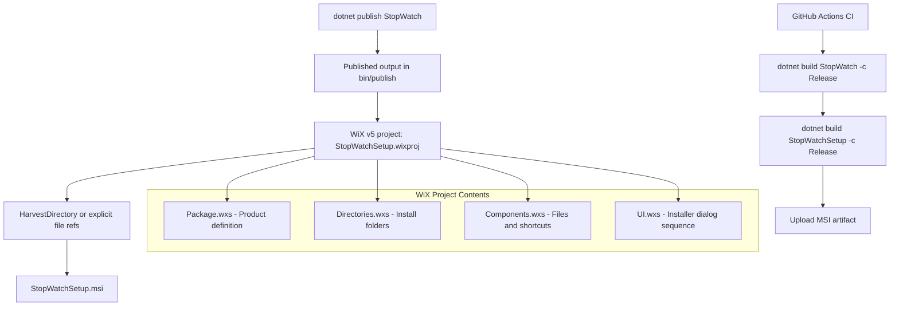

# StopWatchSetup Implementation Plan — Replace .vdproj with WiX v5

## Executive Summary

Replace the legacy Visual Studio Installer project ([`StopWatchSetup.vdproj`](source/StopWatchSetup/StopWatchSetup.vdproj:1)) with a **WiX Toolset v5** MSI project. The `.vdproj` format is incompatible with SDK-style .NET projects and modern CI/CD pipelines. WiX v5 produces equivalent MSI installers, integrates with `dotnet build`, and runs in GitHub Actions without Visual Studio.

---

## Current State Analysis

### What the Existing `.vdproj` Does

| Feature | Current Value |
|---|---|
| Output | `StopWatchSetup.msi` |
| Files packaged | `StopWatch.exe`, `StopWatch.exe.config`, `LICENSE.txt` |
| Install location | `[ProgramFilesFolder]\Carsten Gehling\Jira StopWatch` |
| Start Menu | Shortcut under `Programs\Jira StopWatch` |
| Desktop shortcut | No |
| .NET prerequisite | .NET Framework 4.5 (needs update to .NET 10 Desktop Runtime) |
| Upgrade behavior | Removes previous versions, detects newer installed |
| UpgradeCode | `{292249F1-B39F-4CA1-AA94-28FA5DA3CFFB}` |
| Product version | 2.3.0 |
| Manufacturer | Carsten Gehling |
| Registry keys | HKLM/HKCU `Software\[Manufacturer]` (empty, for future use) |
| UI dialogs | Welcome → Folder → Confirm → Progress → Finished |
| Code signing | Not configured |

### Why Replace

- `.vdproj` requires Visual Studio IDE to build — cannot use `dotnet build` or `msbuild` in CI
- Not compatible with SDK-style projects or .NET 10
- The [CI workflow](`.github/workflows/dotnet-desktop.yml`:91) tries to `msbuild` restore the setup solution but this fails without VS Installer extension
- WiX v5 is MSBuild-native and works with `dotnet build`

---

## Technology Choice: WiX Toolset v5

| Alternative | Pros | Cons | Verdict |
|---|---|---|---|
| **WiX v5** | MSI output, MSBuild-native, `dotnet build` compatible, CI-friendly, feature parity with .vdproj | Learning curve for WiX XML | **Selected** |
| MSIX | Modern Windows packaging | Requires signing cert, Store-oriented, different install UX | Rejected |
| Inno Setup | Simple scripting | Not MSI, separate tool chain | Rejected |
| dotnet publish only | Zero tooling | No installer UX, no Start Menu, no uninstall | Rejected |

---

## Architecture



---

## Detailed Task Breakdown

### Phase 1: Publish Profile Setup

Configure `dotnet publish` for the StopWatch app to produce a clean output folder the WiX project can consume.

#### Task 1.1: Add a publish profile to StopWatch.csproj

Add a publish profile or properties to produce a self-contained or framework-dependent publish output:

- Target: `win-x64` (or `win-x86` for broader compat — the old installer targeted x86 via `TargetPlatform=0`)
- Mode: **Framework-dependent** (smaller MSI, user needs .NET 10 Desktop Runtime — WiX can add a prerequisite check)
- Output: `source/StopWatch/bin/publish/`

Key csproj additions:
```xml
<PropertyGroup>
  <RuntimeIdentifier>win-x64</RuntimeIdentifier>
  <SelfContained>false</SelfContained>
  <PublishDir>bin\publish\</PublishDir>
</PropertyGroup>
```

Alternatively, use command line: `dotnet publish source/StopWatch/StopWatch.csproj -c Release -r win-x64 --self-contained false -o source/StopWatch/bin/publish`

#### Task 1.2: Verify publish output

Ensure the publish output contains:
- `StopWatch.exe` (the app)
- `StopWatch.dll` (in .NET 10, the exe is a host and dll has the IL)
- `StopWatch.deps.json`
- `StopWatch.runtimeconfig.json`
- `RestSharp.dll` and other NuGet dependency DLLs
- Resource/icon files if embedded

---

### Phase 2: Create WiX v5 Project

#### Task 2.1: Create `source/StopWatchSetup/StopWatchSetup.wixproj`

Create an SDK-style WiX project file:

```xml
<Project Sdk="WixToolset.Sdk/5.0.2">
  <PropertyGroup>
    <OutputType>Package</OutputType>
    <InstallerPlatform>x64</InstallerPlatform>
  </PropertyGroup>

  <ItemGroup>
    <ProjectReference Include="..\StopWatch\StopWatch.csproj" />
  </ItemGroup>
</Project>
```

The `ProjectReference` to StopWatch ensures the app builds before the installer and publish output is available.

#### Task 2.2: Create `source/StopWatchSetup/Package.wxs`

Main WiX source file defining the MSI package:

```xml
<Wix xmlns="http://wixtoolset.org/schemas/v4/wxs">
  <Package
    Name="Jira StopWatch"
    Manufacturer="Carsten Gehling"
    Version="2.3.0"
    UpgradeCode="292249F1-B39F-4CA1-AA94-28FA5DA3CFFB"
    Scope="perMachine">

    <MajorUpgrade
      DowngradeErrorMessage="A newer version of Jira StopWatch is already installed." />

    <MediaTemplate EmbedCab="yes" />

    <!-- .NET 10 Desktop Runtime prerequisite -->
    <dotNetCoreSearch
      RuntimeType="desktop"
      MajorVersion="10"
      Variable="NetDesktopRuntime10" />

    <Launch
      Condition="NetDesktopRuntime10"
      Message="This application requires the .NET 10 Desktop Runtime. Please install it from https://dotnet.microsoft.com/download" />

    <!-- Features -->
    <Feature Id="Main" Title="Jira StopWatch" Level="1">
      <ComponentGroupRef Id="PublishComponents" />
      <ComponentRef Id="StartMenuShortcut" />
      <ComponentRef Id="LicenseFile" />
    </Feature>
  </Package>
</Wix>
```

#### Task 2.3: Create `source/StopWatchSetup/Directories.wxs`

Define the install directory structure:

```xml
<Wix xmlns="http://wixtoolset.org/schemas/v4/wxs">
  <Fragment>
    <StandardDirectory Id="ProgramFiles6432Folder">
      <Directory Id="ManufacturerFolder" Name="Carsten Gehling">
        <Directory Id="INSTALLFOLDER" Name="Jira StopWatch" />
      </Directory>
    </StandardDirectory>

    <StandardDirectory Id="ProgramMenuFolder">
      <Directory Id="StartMenuDir" Name="Jira StopWatch" />
    </StandardDirectory>
  </Fragment>
</Wix>
```

#### Task 2.4: Create `source/StopWatchSetup/Components.wxs`

Define files to include. Two approaches:

**Option A — HarvestDirectory (auto-discover):**
Use the WiX `HeatDirectory` or built-in publish harvesting to auto-include all files from the publish output. This is simpler and automatically picks up new dependencies.

**Option B — Explicit file references:**
Manually list each file. More control but maintenance burden when dependencies change.

**Recommendation:** Use the WiX v5 `PublishDir` harvesting via ProjectReference, which automatically includes all published files. This is the modern WiX v5 approach.

With the ProjectReference in the wixproj, WiX v5 automatically harvests the published output. The components file would just add extras like the license:

```xml
<Wix xmlns="http://wixtoolset.org/schemas/v4/wxs">
  <Fragment>
    <ComponentGroup Id="LicenseComponents" Directory="INSTALLFOLDER">
      <Component Id="LicenseFile">
        <File Source="..\..\LICENSE.txt" />
      </Component>
    </ComponentGroup>

    <Component Id="StartMenuShortcut" Directory="StartMenuDir">
      <Shortcut
        Id="StartMenuJiraStopWatch"
        Name="Jira StopWatch"
        Target="[INSTALLFOLDER]StopWatch.exe"
        WorkingDirectory="INSTALLFOLDER" />
      <RemoveFolder Id="RemoveStartMenuDir" On="uninstall" />
      <RegistryValue
        Root="HKCU"
        Key="Software\Carsten Gehling\Jira StopWatch"
        Name="installed"
        Type="integer"
        Value="1"
        KeyPath="yes" />
    </Component>
  </Fragment>
</Wix>
```

#### Task 2.5: Configure WiX UI extension for installer dialogs

Add the WiX UI extension for the standard dialog sequence (Welcome → Folder → Confirm → Progress → Finished), matching the existing `.vdproj` UI flow:

In `StopWatchSetup.wixproj`:
```xml
<ItemGroup>
  <PackageReference Include="WixToolset.UI.wixext" Version="5.0.2" />
</ItemGroup>
```

In `Package.wxs`:
```xml
<UI>
  <ui:WixUI Id="WixUI_InstallDir" InstallDirectory="INSTALLFOLDER"
            xmlns:ui="http://wixtoolset.org/schemas/v4/wxs/ui" />
</UI>
```

#### Task 2.6: Add license agreement to installer

The existing `.vdproj` does not show a license dialog, but it includes `LICENSE.txt` in the install folder. Keep the same behavior. Optionally, the WiX UI can show the license if `WixUI_Mondo` or a custom sequence is used.

---

### Phase 3: Update Solution Files

#### Task 3.1: Update `StopWatchSetup.sln`

Replace the `.vdproj` reference with the new `.wixproj`:

```
Project("{A5A43C5B-DE2A-4C0C-9213-0A381AF9435A}") = "StopWatchSetup", "source\StopWatchSetup\StopWatchSetup.wixproj", "{696B7D99-7B47-47FD-B792-B502B428F50F}"
EndProject
```

Note: GUID `{A5A43C5B-DE2A-4C0C-9213-0A381AF9435A}` is the WiX v5 project type. Alternatively, use the C# project GUID since WiX v5 SDK projects work like standard SDK projects.

#### Task 3.2: Optionally add setup project to main `StopWatch.sln`

Consider consolidating into a single solution file. The setup project can reference the main app project, so having them in one solution simplifies CI/CD. However, keeping them separate is also valid since not all contributors need WiX tooling.

**Recommendation:** Keep separate solutions but update the CI workflow to build both.

---

### Phase 4: Update CI/CD Workflow

#### Task 4.1: Update `.github/workflows/dotnet-desktop.yml`

The current workflow targets .NET 6 and tries to `msbuild` the `.vdproj`. Update to:

1. **Install .NET 10 SDK** instead of .NET 6
2. **Build the main solution** with `dotnet build`
3. **Run tests** with `dotnet test`
4. **Build the setup project** with `dotnet build source/StopWatchSetup/StopWatchSetup.wixproj -c Release`
5. **Upload the MSI artifact**

```yaml
name: .NET Desktop

on:
  push:
    branches: [master]
  pull_request:
    branches: [master]

jobs:
  build:
    strategy:
      matrix:
        configuration: [Debug, Release]
    runs-on: windows-latest

    steps:
    - name: Checkout
      uses: actions/checkout@v4
      with:
        fetch-depth: 0

    - name: Install .NET 10
      uses: actions/setup-dotnet@v4
      with:
        dotnet-version: 10.0.x

    - name: Restore
      run: dotnet restore StopWatch.sln

    - name: Build
      run: dotnet build StopWatch.sln -c ${{ matrix.configuration }} --no-restore

    - name: Test
      run: dotnet test StopWatch.sln -c ${{ matrix.configuration }} --no-build

    - name: Build Installer
      if: matrix.configuration == 'Release'
      run: dotnet build source/StopWatchSetup/StopWatchSetup.wixproj -c Release

    - name: Upload MSI
      if: matrix.configuration == 'Release'
      uses: actions/upload-artifact@v4
      with:
        name: StopWatchSetup-MSI
        path: source/StopWatchSetup/bin/Release/*.msi
```

---

### Phase 5: Clean Up and Verify

#### Task 5.1: Delete the old `.vdproj` file

Remove [`source/StopWatchSetup/StopWatchSetup.vdproj`](source/StopWatchSetup/StopWatchSetup.vdproj:1) after the new WiX project is verified working.

#### Task 5.2: Build and test the MSI locally

1. `dotnet build source/StopWatchSetup/StopWatchSetup.wixproj -c Release`
2. Verify MSI is produced in `source/StopWatchSetup/bin/Release/`
3. Install the MSI on a test machine
4. Verify:
   - App installs to `C:\Program Files\Carsten Gehling\Jira StopWatch`
   - Start Menu shortcut is created under `Jira StopWatch`
   - Application launches correctly
   - Uninstall works cleanly
   - Upgrade over previous version works (if applicable)

#### Task 5.3: Update `PROJ_STATUS.md`

Update the setup section in [`PROJ_STATUS.md`](PROJ_STATUS.md:21) to reflect the WiX v5 migration:

```markdown
| Setup    | [`StopWatchSetup.sln`](StopWatchSetup.sln:1) | WiX v5 MSI installer project (`StopWatchSetup.wixproj`) |
```

---

## Feature Parity Checklist

| Feature | .vdproj | WiX v5 | Notes |
|---|---|---|---|
| MSI output | ✅ | ✅ | Same format |
| Install to Program Files | ✅ | ✅ | Same path structure |
| Start Menu shortcut | ✅ | ✅ | Same location |
| LICENSE.txt included | ✅ | ✅ | Same behavior |
| Upgrade detection | ✅ | ✅ | Same UpgradeCode preserved |
| Remove previous versions | ✅ | ✅ | MajorUpgrade element |
| .NET prerequisite check | ✅ (.NET 4.5) | ✅ (.NET 10 Desktop Runtime) | Updated target |
| Welcome/Folder/Confirm UI | ✅ | ✅ | WixUI_InstallDir |
| CI/CD buildable | ❌ | ✅ | Major improvement |
| dotnet build compatible | ❌ | ✅ | Major improvement |

---

## Risk Assessment

| Risk | Impact | Mitigation |
|---|---|---|
| WiX v5 SDK not available on CI runner | Medium | WiX v5 NuGet packages are restored automatically via PackageReference |
| UpgradeCode mismatch breaks upgrades | High | Preserve exact UpgradeCode GUID from .vdproj |
| Missing files in MSI | Medium | Use ProjectReference auto-harvesting; verify publish output |
| .NET 10 runtime not yet in GA | Low | CI uses preview SDK; runtime prereq check warns users |
| Users with old MSI cannot upgrade | Low | MajorUpgrade with same UpgradeCode handles this |

---

## Orchestrator Task Sequence

The Orchestrator should coordinate these subtasks in order:

1. **Subtask: Publish profile** — Add publish configuration to `StopWatch.csproj`, verify publish output
2. **Subtask: Create WiX project** — Create `StopWatchSetup.wixproj`, `Package.wxs`, `Directories.wxs`, `Components.wxs` with all installer features
3. **Subtask: Update solutions** — Update `StopWatchSetup.sln` to reference new `.wixproj`
4. **Subtask: Update CI/CD** — Modernize `.github/workflows/dotnet-desktop.yml` for .NET 10 + WiX v5
5. **Subtask: Clean up** — Delete old `.vdproj`, update `PROJ_STATUS.md`
6. **Subtask: Build and verify** — Build MSI locally, verify installation behavior
